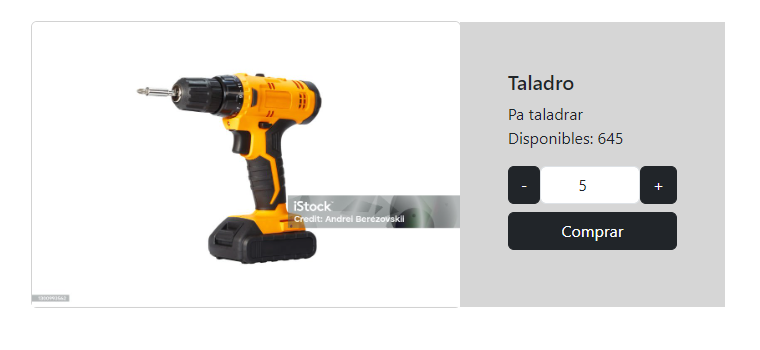
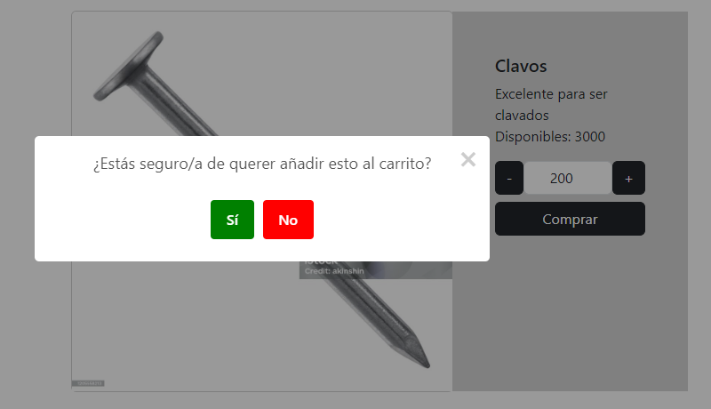
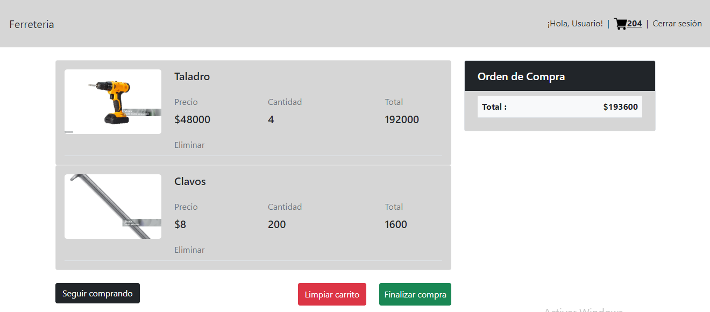

# FERRETERÍA
Creando un sitio web para una ferretería utilizando javascript para agregarle dinamismo y demás funcionalidades

>[!IMPORTANT]
> Cabe aclarar que si accedemos desde github pages al sitio web va a estar bugueado, lo recomendado es acceder clonando el repositorio y ejecutandolo en local

## Stack
    -HTML
    -CSS
    -Bootstrap
    -Javascript

## Capturas

